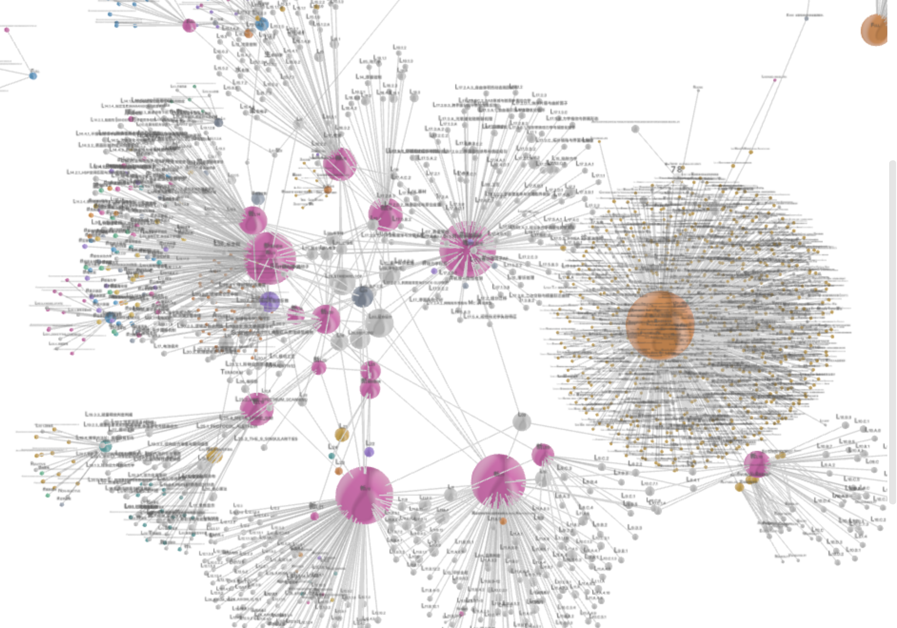
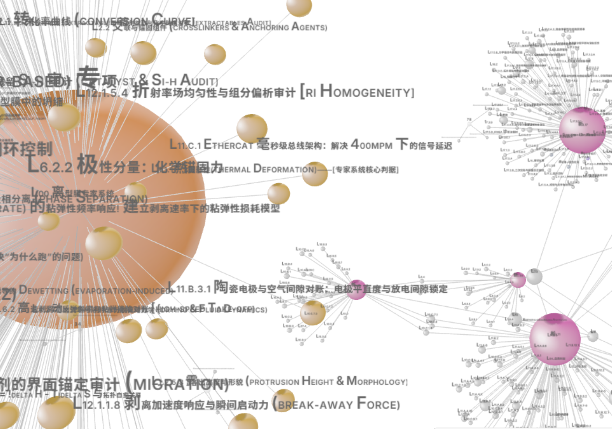

::: {.panel-tabset}
### English
**COSMOS Knowledge Graph: An Axiomatic Foundation for Material Engineering.**

COSMOS transcends its origins in release film engineering, evolving into a unified framework for the broader coating and precision manufacturing industry. By formalizing 800+ interconnected nodes—ranging from fundamental surface energy axioms (L01) and material response matrices (L02) to advanced process audit protocols (L22)—we have constructed a domain-agnostic physical knowledge graph. 

{width=85% fig-align="center"}

This architecture anchors manufacturing decisions to deterministic physical invariants, allowing for seamless migration across disciplines—from high-performance tapes to semiconductor lithography. By decoupling scientific discovery from stochastic trial-and-error, COSMOS provides a universal, axiom-driven engine for deterministic material design.

{width=85% fig-align="center"}

### 中文
**COSMOS 知识图谱：材料工程的公理化底座**

COSMOS 已超越了单一的离型膜工程范畴，演变为涵盖胶带、胶水、功能薄膜等全涂布领域的统一架构。通过将 800 余个关联节点进行公理化建模——从 L01 的表面能基准，到 L02 的材料响应矩阵，再至 L22 的全闭环逻辑审计协议——我们构建了一个严谨的、领域无关的物理知识图谱。

{width=85% fig-align="center"}

这一架构将制造决策锚定在确定性的物理常数与边界条件之上，具备极强的跨学科迁移能力：从精密胶粘剂到半导体光刻胶，乃至生物医疗涂层，COSMOS 正在将“随机试错”转化为“由公理驱动的确定性解析”。

{width=85% fig-align="center"}
:::