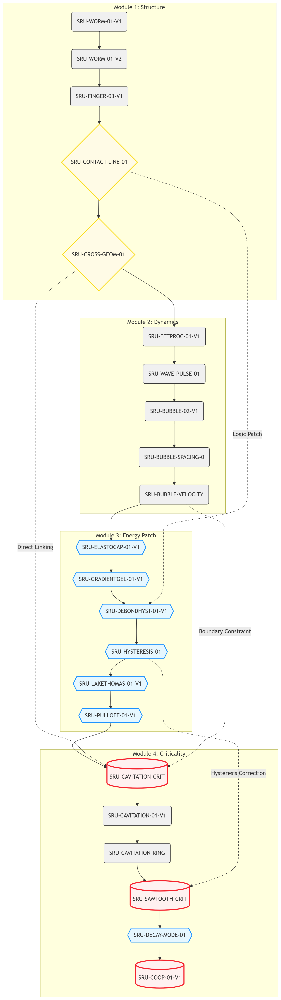

::: {.panel-tabset}
### English
::: {.callout-note appearance="minimal"}

<h3 style="margin-top: 0; font-size: 1.25rem;">Chapter 1: Audit Mandate</h3>

This audit report provides a comprehensive logical analysis of _Adhesion-induced instabilities and pattern formation in thin films of elastomers and gels_ (Chaudhury, M. K., Chakrabarti, A., & Ghatak, A. (2015). _European Physical Journal E_, 38:82).

#### 1.1 Audit Philosophy and Logical Axioms

Scientific literature constitutes self-consistent, mathematically closed causal streams. We hereby establish a fundamental engineering axiom: all phenomena within Scientific, Technical, and Engineering (STE) domains are explicit extensions of the constitutive mechanisms defined in classical reference literature.

#### 1.2 Selection and Positioning of the Physical Sample

We define the aforementioned literature as a high-purity “causal stream” sample representing interfacial instability in coating processes, such as those found in release films and adhesive tapes. We have selected this document as the **Root of Trust (RoT)** for our compilation, not merely due to its representative status in elastic instability, but because its logical rigor serves as an ideal “physical sample” to validate the SRU (Scientific Reasoning Unit) governance architecture.

By incorporating this literature into the SRU audit scope, our objective extends beyond mere conclusion replication. Through SRU mapping technology, we decompose the complex phenomenological evolution within the paper into logically independent atomic units. This methodology is designed to eliminate contextual ambiguity at the source, ensuring that every derived engineering conclusion inherits the deterministic integrity of the original reference material.

#### 1.3 Audit Responsibility and Positioning

This report transcends traditional literature reviews by adopting the perspective of a “Logical Audit” to enforce alignment across the original causal chains. We are committed to identifying the logical convergence limitations of classical models at cross-scale physical boundaries, thereby establishing a protocol for the transformation of engineering parameters that is globally scalable and schedulable.

### Chapter 2: Global SRU Mapping and Core Logical Framework

#### 2.1 From Global Scope to Core: 22 Key Scientific Reasoning Units (SRUs)

While the comprehensive digital twin architecture for this literature encompasses 89 governance nodes, our deep audit has precisely distilled **22 core Scientific Reasoning Units (SRUs)**. These 22 SRUs constitute the "minimal complete set" of the original physical logic; any deduction or challenge regarding the literature's conclusions must be fulfilled within this closed logical loop.

#### 2.2 Audit Visualization
`Figure Audit visualization of the 22-SRU minimal complete set derived from the reference. The graph delineates the causal chain from observed physical facts to critical governance breakpoints, highlighting theoretical patches (hexagons) and logical conclusions (cylinders) identified through COSMOS protocol alignment.`

#### 2.3 SRU Node Coding Logic and Audit Definitions

To ensure the rigor of our logical governance, we have implemented a visualization coding system for the core nodes in our audit charts, designed to reveal implicit "logical pivots" and "patch behaviors" within the original text:

- **Observation/Fact (Rounded Rectangle):** The baseline for physical reality under audit, representing the experimental observational data from the literature.
    
- **Logical Divergence (Diamond):** Represents the logical decision space encountered by the authors when addressing multi-modal competitions (e.g., worm-like patterns vs. bubble competition).
    
- **Theoretical Patch (Hexagon):** **The core audit focus.** This represents areas within the original logical chain where classical theory could not provide coverage, necessitating the introduction of ad-hoc assumptions. These nodes define the "physical boundaries" of the model during cross-scale migration.
    
- **Conclusion (Cylinder):** The logical terminus of the SRU chain, representing the primary conclusions drawn in the original literature.

### Chapter 3: Critical Audit Findings

#### Logical Vulnerability: The Coupled Chain of SRU-BUBBLE-SPACING-0 and SRU-CAVITATION-CRIT

When explaining the wavelength selectivity of thin-film instability, the original literature establishes a robust causal chain through the coupling of **SRU-BUBBLE-SPACING-0 (Bubble spacing energy minimization model)** and **SRU-CAVITATION-CRIT (Cavitation critical geometric constraint)**. However, our audit reveals that when the system enters a high-load dynamic environment, this coupling path exhibits non-linear divergence. Specifically, the original model fails to fully mitigate the stress concentration singularities generated at **SRU-BUBBLE-VELOCITY (Bubble evolution velocity term)**.

#### Audit Commentary on “Hexagonal Nodes” (Theoretical Patches)

When addressing the **"Non-linear coupling of elastocapillary effects in gradient gels,"** the authors employ hexagonal nodes—namely **SRU-GRADIENTGEL-01-V1** and **SRU-DERONDHYST-01-V1**—to bypass complex calculations of interfacial stress fluctuations. Viewed through the lens of SRU audit governance, these nodes essentially reduce the “dynamic response process of the interfacial micro-environment” to an “empirical hysteresis parameter correction.” This reductionist approach constitutes a critical logical breakpoint that causes the model to lose predictive accuracy under ultra-thin film conditions during cross-domain migration.

### Chapter 4: Methodological Value

#### 4.1 Paradigm Shift: From “Literature Analysis” to “Logical Governance”

This audit is not limited to the logical reconstruction of the referenced literature; its core value lies in validating the universality of the **SRU Governance Protocol**. By deconstructing and re-mapping the 22 core SRUs, we demonstrate:

- **Standardization of Physical Interpretability:** Any scientific literature can be transformed into a set of logical operators readable by computational systems.
    
- **Black-Box Transparency:** By identifying the “theoretical patches” (hexagonal nodes) within the text, we precisely pinpoint the analytical limits of classical models, thereby converting passive “reading comprehension” into the “precise positioning of engineering parameters.”
    

#### 4.2 Industrial Application Potential of the “SRU Audit Method”

This audit methodology is not restricted to academic literature; it is directly transferable to internal R&D logs, Standard Operating Procedures (SOPs), and process audits. Its primary contribution is providing a “Logical Anchoring Tool” that transforms vague empirical knowledge into deterministic knowledge assets composed of logical atoms.

### Chapter 5: Audit Verdict

- **Logical Robustness:** The model demonstrates strong physical self-consistency under [low-strain, quasi-static] boundary conditions.
    
- **Governance Breakpoints:** The model contains logical breakpoints within the SRU chains involving [high-frequency viscoelastic loss] and [dynamic mode transitions]. These represent the inherent boundaries of classical mechanical analysis and are the root causes of the predictive deviations observed in complex coating processes.
:::

{fig-align="center" width="70%"}
*(Figure 1: Full-Scope SRU)*
:::

### 中文
::: {.callout-note appearance="minimal"}

<h3 style="margin-top: 0; font-size: 1.25rem;">第一章：审计缘起 (The Mandate)</h3>

本审计报告旨在对 _Adhesion-induced instabilities and pattern formation in thin films of elastomers and gels_  （Chaudhury, M. K., Chakrabarti, A., & Ghatak, A. (2015). European Physical Journal E_, 38:82。）进行全域逻辑解析。

**1.1 审计哲学与逻辑公理**

科学文献构成了自洽的、数学上封闭的因果流（mathematically closed causal streams）。我们在此确立一项基础工程公理：所有工业科学与工程（STE）现象，均是经典参考文献中所定义之本构机制的显性延伸。

**1.2 物理样本的选择与定位** 我们将以上文献样本视为离型膜、胶带等涂布工程中，界面失稳现象的一段高纯度“因果流”样本。选择该文献作为编译的 **Root of Trust (RoT)**，不仅是因为其在弹性不稳定性领域的代表性，更因为其逻辑严密性能够作为测试 SRU（科学推理单元）治理架构的完美“物理样本”。

通过将该文献纳入 SRU审计范畴，我们的目标不仅是复现其结论，而是通过 SRU 映射技术，将该文献中复杂的现象演化分解为具有因果独立性的逻辑原子。此举旨在从源头上消除语境歧义，确保每一个衍生出的工程结论，均能继承原始参考资料的确定性完整度。

**1.3 审计职责定位**

本报告不满足于传统意义上的文献综述，而是以“逻辑审计”为视角，对原文的因果链路进行强制对齐。我们致力于识别经典模型在跨尺度物理边界下的逻辑收敛局限性，并建立一套可全局调度的工程参数转化协议。。

### 第二章：全域 SRU 映射与核心逻辑框架 (The Logical Mapping)

**2.1 从全域到核心：22 个关键推理单元 (SRUs)** 虽然该文献的全域数字孪生架构包含 89 个治理节点，但在进行深度审计时，我们精确提炼出了 **22 个核心科学推理单元 (SRUs)**。这 22 个 SRU 构成了原文物理逻辑的“最小完备集合”，任何对该文献结论的推演或质疑，均必须在这一逻辑闭环内完成。

**2.2 逻辑治理链路图 (Audit Visualization)** 

**2.3 SRU 节点编码逻辑与审计定义** 为确保逻辑治理的严谨性，我们对审计图表中的核心节点进行了可视化编码，旨在揭示原文中隐含的“逻辑转折”与“补丁行为”：

- **观测/事实 (圆角矩形)**：审计物理实在的基准点，即原文中的实验观测数据。
    
- **论证分流 (菱形)**：揭示了作者在处理多模态竞争（如虫状条纹与气泡竞争）时的逻辑选择空间。
    
- **理论补丁 (六边形)**：**本审计的核心审计点。** 这是原文逻辑链条中，经典理论无法覆盖、需引入临时假设进行解释的区域。这标志着模型在跨尺度迁移中的“物理边界”。
    
- **结论 (圆柱)**：该 SRU 链条的逻辑落脚点，即原文的核心结论。

**第三章：关键逻辑命门**
审计发现 SRU-BUBBLE-SPACING-0 与 SRU-CAVITATION-CRIT 在动态环境下存在耦合发散。六边形节点（理论补丁）实质上是将微环境响应简化为经验修正，这是模型在跨尺度迁移中的关键断点。

### 第四章：方法论范式价值 (Methodological Value)

**4.1 从“文献解析”到“逻辑治理”的范式转移** 本次审计并非止步于对文献样本的逻辑重构，其核心价值在于验证了 **SRU 逻辑治理协议 (SRU Governance Protocol)** 的通用性。通过对 22 个核心 SRU 的解构与重映射，我们证明了：

- **物理可解释性的标准化**：任何工业科学文献，均可被转化为一套可被计算机读取的逻辑算子。
    
- **黑盒透明化**：通过对文献中“理论补丁（六边形）”的识别，我们能够精确锁定经典模型的解析极限，从而将“阅读理解”转化为“工程参数的精准定位”。
    

**4.2 “SRU 审计法”的工业级应用潜力** 这种审计方法不仅适用于学术文献，更可直接平移至企业内部的研发日志、标准操作规程 (SOP) 及工艺审计中。其核心贡献在于：它提供了一种“逻辑锚定工具”，将原本模糊的“经验积累”转化为由逻辑原子构成的“确定性知识资产”。

### 第五章：审计结论与后续建议 (Audit Verdict)

- **逻辑稳固性**：该模型在 [低应变、准静态] 的边界条件下，物理自洽性较强。
    
- **治理断点**：在涉及 [高频粘弹性损耗] 与 [动态模式跃迁] 的 SRU 链条中，模型存在逻辑断点。这是经典力学解析的固有边界，也是导致其在复杂涂布工艺中出现预测偏差的根源。。
:::

{fig-align="center" width="70%"}
*(图：SRU 逻辑治理架构汇总)*

:::