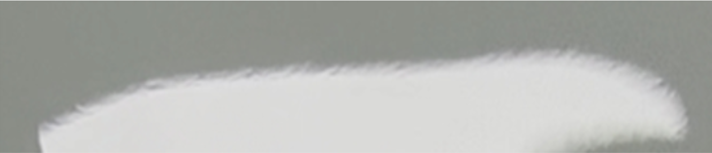
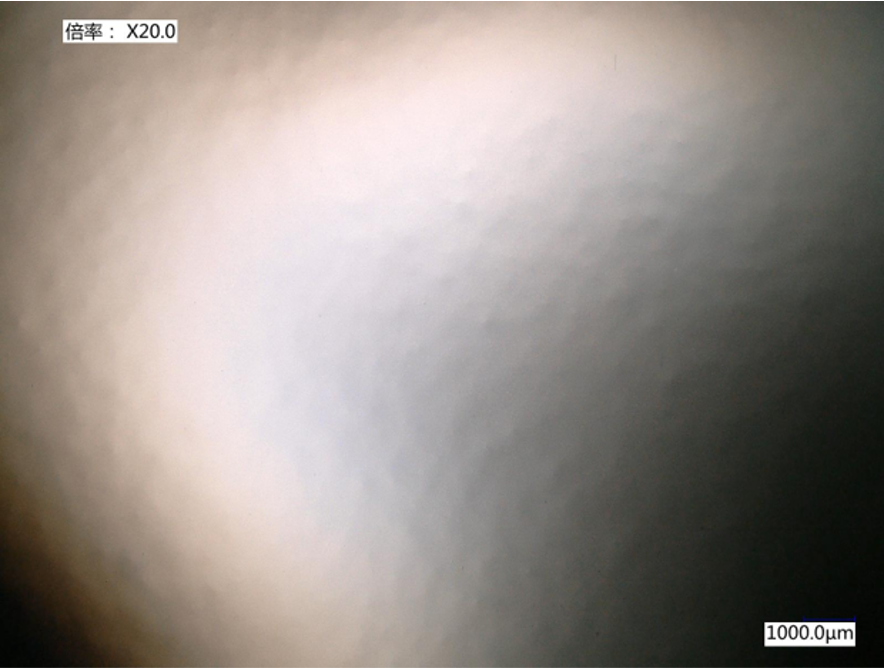
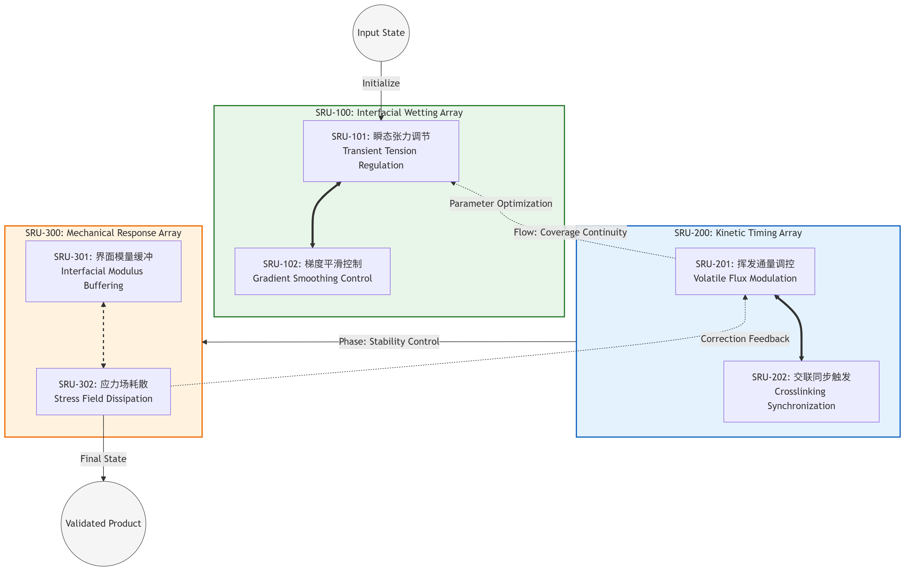
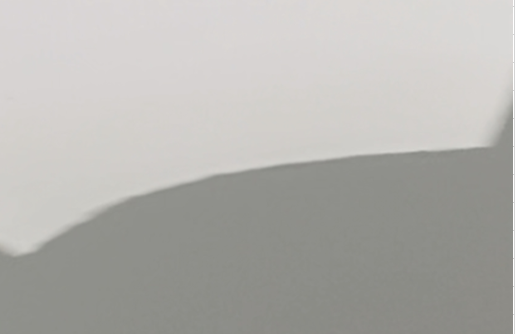

::: {.panel-tabset}
### English
**Chapter 1: Phenomenon Characterization**
**Observation: Stress-Induced Topological Instability in Constrained Elastic Layers.**

This activity focuses on the systematic diagnosis of surface morphology instability during the winding and curing process of Paint Protection Film (PPF). The phenomenon is characterized by a topological transition of the self-healing layer from a smooth state to a non-linear fluctuating state (pseudo-orange peel), driven by constrained interfacial stress fields.

#### 1. Multi-scale Morphology Analysis 

By deconstructing abnormal samples across multiple scales, we have established a benchmark imaging taxonomy for this phenomenon:

- **Macro-scale Manifestation**: Under non-magnified conditions, the self-healing surface exhibits a distinct long-range non-uniform distribution. This visual distortion correlates precisely with the radial stress gradient distribution induced during the winding process.
    
- **Micro-scale Topological Instability**: Utilizing X20 optical microscopy, we successfully captured stress-concentrated regions triggered by interfacial nucleation sites. The data shows that the wavelength evolution of the pseudo-orange peel follows the local stress-release laws defined by non-linear elastic theory, confirming the failure of the interfacial mechanical boundary conditions.

#### 2. Diagnostic Mapping

The essence of this issue is not a chemical deficiency in the coating formulation, but an imbalance in the coupled response between the microscopic physical morphology of the release film and the PSA (Pressure Sensitive Adhesive) molecular dynamics within a complex stress field. Through multi-scale characterization, we define this phenomenon as: **"Transient topological instability in constrained interfaces, driven by the winding tension field."**

::: {layout="[[50, 50]]"}

::: {#fig-macro-distortion}
{width="90%"}

Macro-scale manifestation Winding-induced surface distortion at the macroscopic level (Unmagnified). Consistent with interfacial stress concentration.
:::

::: {#fig-micro-instability}
{width="90%"}

Micro-scale topological instability X20 Optical Microscopy: Revealing the underlying non-linear topology (pseudo-orange peel) at the release-film interface.
:::

:::

**Chapter 2: Process Analysis (SRU Logic Mapping)**
**Systemic Deconstruction: The SRU Governance Architecture.**

To address the aforementioned interfacial instability, we have abandoned traditional "trial-and-error" machine adjustment logic in favor of causal link mapping via the SRU (Scientific Reasoning Unit) Governance Protocol. This architecture is designed to establish a logical closed-loop between the physical pinning effects on the release film surface and the dynamic rheological process of the coating.

#### 1. Logic Architecture

We have deconstructed the entire winding process into six core SRU operators, visualizing the energy transfer and evolution pathways via the following physical connectivity map:

- **Logic Mapping**: Each node in the diagram represents a physical decision point, while the connections represent the pathways of stress and energy propagation.
    
- **Governance Nodes**: By exerting precise governance over these critical nodes, we have transformed ambiguous "process parameter adjustments" into the stable output of logical operators.

#### 2. Governance Protocol 

Under this architecture, process adjustment is no longer a matter of aggregating chemical formulations, but a process of aligning logical states:

- **Constraint Identification**: We identify the non-linear amplification pathways of winding stress within the multi-layer film structure.
    
- **Flow-State Synchronization**: By adjusting the parameters of the SRU operators, we ensure that the coating’s Flow-out Curve and the Gelation Window are synchronized at the critical physical transition points.

::: {.callout-note appearance="minimal"}

::: {#fig-governance layout-ncol=1}
{width="100%"}

The SRU (Scientific Reasoning Unit) Governance Map designed for pseudo-orange-peel mitigation. This flow-chart delineates the causal coupling between interfacial wetting (SRU-100), drying kinetics (SRU-200), and mechanical stress dissipation (SRU-300). Arrows signify the logical governance path, while dotted lines represent the closed-loop feedback parameters for real-time process optimization.
:::

:::

**Chapter 3: Performance Validation**

**Outcome: Achieving Morphological Equilibrium.**

Through the implementation of the comprehensive SRU Governance Protocol, the system has successfully transitioned from an unstable state to one of equilibrium. The following is the status of the finished product post-protocol implementation:

**Verification Summary:**

- **Status**: [Validated / Fully Recovered]
    
- **Morphological Integrity**: Surface morphology has been fully restored to a defect-free, planar state.
    
- **Evidence**: Following a comprehensive multi-scale (macro and micro) audit, the pseudo-orange-peel defects have been completely eliminated.

::: {#fig-post-audit}
{width="70%"}

Post-audit inspection of the self-healing surface following the implementation of the SRU Governance Protocol. The absence of topological distortion confirms the restoration of interfacial stability and the successful mitigation of winding-induced energy non-linearity.
:::

> *"Engineering is the bridge between chaotic physical phenomena and predictable industrial output. We don't just fix defects; we govern the process."*

:::

### 中文
**第一章：现象表征**
**现象定性：受限弹性层中应力诱导的拓扑失稳。**

本活动旨在对 PPF（漆面保护膜）收卷熟化过程中出现的表面形貌失稳现象进行系统性诊断。该现象表现为自修复层在受限界面应力场作用下，由平整态向非线性起伏态（伪橘皮纹）的拓扑跃迁。

#### 1. 多尺度形貌表征
通过对异常样本的跨尺度解构，我们建立了现象的基准图像谱系：

- **宏观表征**：在无放大条件下，自修复表面呈现出明显的长程非均匀分布。这种视觉畸变与收卷过程中的径向应力梯度分布高度一致。
- **微观拓扑失稳**：通过 X20 光学显微成像，可精确捕捉到由界面形核点诱发的应力集中区域。数据表明，伪橘皮纹的波长演化完全遵循非线性弹性理论中的局部应力释放规律，确证了界面力学边界条件的失效。

#### 2. 诊断映射
该问题的本质并非涂布配方的化学缺失，而是离型膜微观物理形貌与 PSA（压敏胶）分子动力学在复杂应力场下的耦合响应失衡。通过多尺度表征，我们将该现象定性为：**“由收卷张力场驱动的、受限界面下的瞬态拓扑失稳”。**

::: {layout="[[50, 50]]"}

  {width="90%"}
  
<strong>图 1</strong>：宏观表征：宏观收卷诱导的表面畸变（无放大）。与界面应力集中高度一致。

  {width="90%"}
  
<strong>图 2</strong>：微观拓扑失稳：X20 光学显微成像揭示离型膜界面处的非线性拓扑（伪橘皮纹）。

:::

**第二章：过程分析 (SRU 逻辑图谱扫描)**
**系统性解构：SRU 治理架构。**

针对上述界面失稳现象，我们放弃了传统的“试错法”调机逻辑，转而通过 **SRU (Scientific Reasoning Unit) 逻辑治理协议**对收卷过程进行因果链路映射。本架构旨在将离型膜表面的物理钉扎效应与涂层动态流变过程进行逻辑闭环。

#### 1. 逻辑架构

我们将整个收卷过程拆解为 6 个核心 SRU 算子，通过物理连接图示化了能量传递与演化路径：

- **Logic Mapping**：图中每一个节点（Node）代表一个物理决策点，连线代表应力与能量的传递路径。
    
- **Governance Nodes**：通过对图中关键节点（Governance Nodes）的精准治理，我们将原本模糊的“工艺参数调整”转化为“逻辑算子的稳态输出”。

#### 2. 治理协议

在该架构下，工艺调整不再是化学配方的堆叠，而是逻辑状态的对齐：

- **Constraint Identification**：识别收卷应力在多层膜结构中的非线性放大路径。
    
- **Flow-State Synchronization**：通过调整 SRU 算子参数，确保涂层流平曲线（Flow-out Curve）与固化动力学窗口（Gelation Window）在物理临界点处实现时序同步。

::: {.callout-note appearance="minimal"}

  {width="100%"}
  
<strong>图 3</strong>：专为伪橘皮纹治理设计的 SRU（科学推理单元）治理图谱。该流程图描绘了界面润湿 (SRU-100)、干燥动力学 (SRU-200) 与力学应力耗散 (SRU-300) 之间的因果耦合关系。实线箭头代表逻辑治理路径，虚线代表实现实时工艺优化的闭环反馈参数。

:::

**第三章：性能验证**
**结论：达成形貌平衡态。**

通过全域 SRU 治理协议的实施，系统成功实现了从“失稳态”到“平衡态”的跃迁。以下为协议实施后的成品状态：

**Verification Summary (性能审计结论):**

- **Status**: [Validated / Fully Recovered]
    
- **Morphological Integrity**: 表面形貌已完全恢复至无缺陷平整态。
    
- **Evidence**: 经多尺度（宏观与微观）全方位审计，伪橘皮纹缺陷已彻底消除。

  {width="70%"}
  
<strong>图 4</strong>：实施 SRU 治理协议后的自修复表面审计。拓扑畸变的消失，证实了界面稳定性的恢复，以及收卷产生的能量非线性干扰得到了成功抑制

> *"工程是混沌物理现象与可预测工业输出之间的桥梁。我们不只是修复缺陷，我们是在治理工艺本身。"*