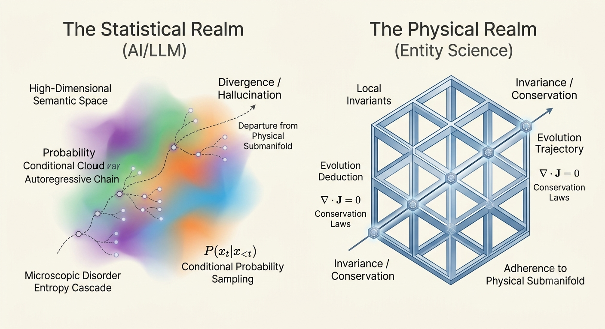
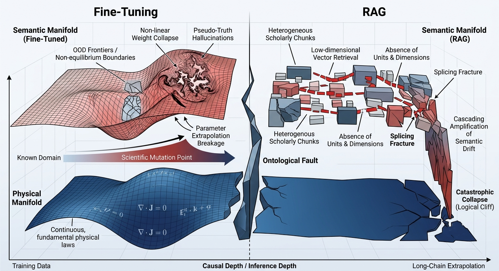
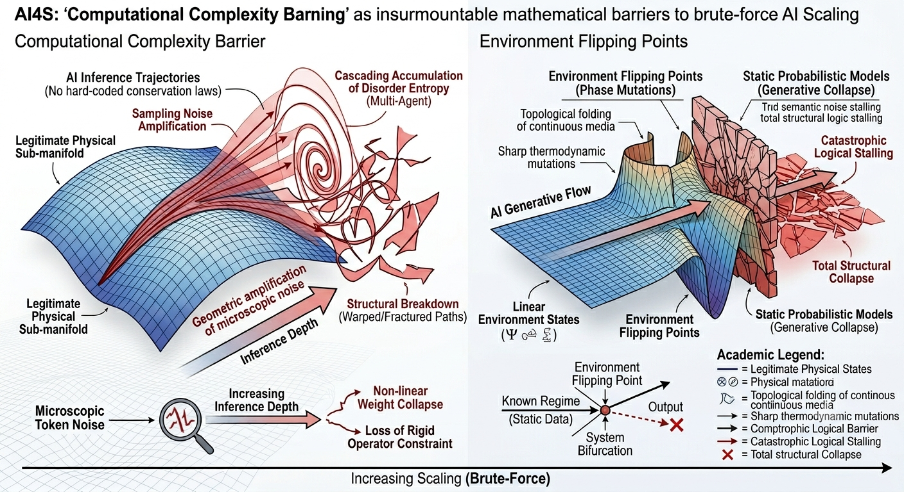
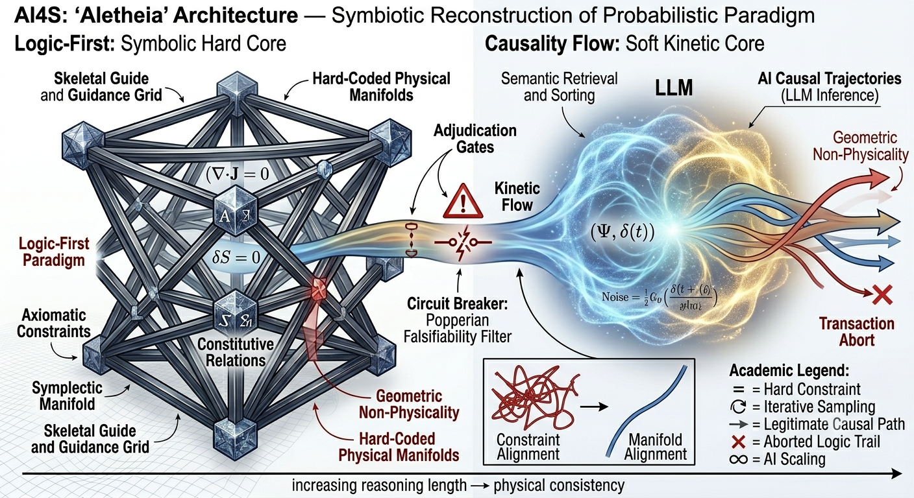
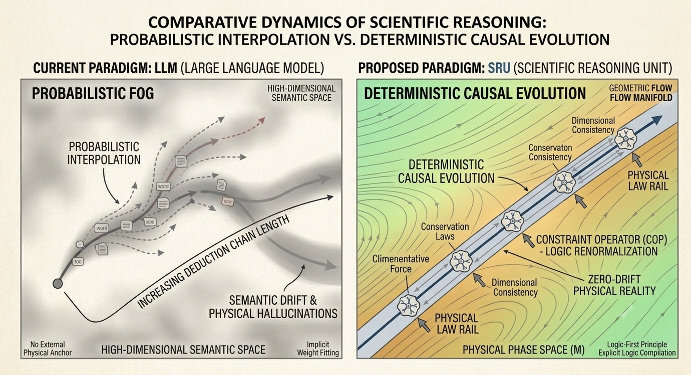
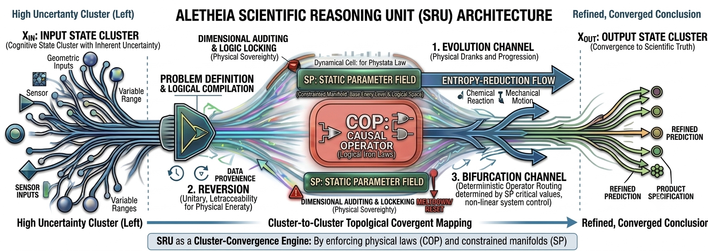
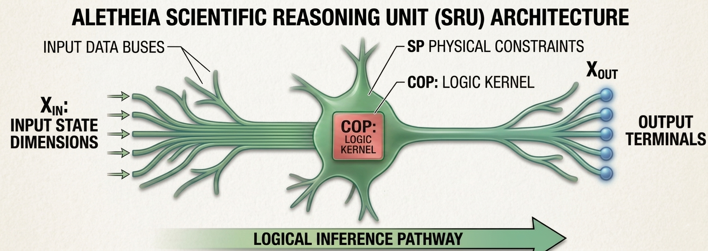
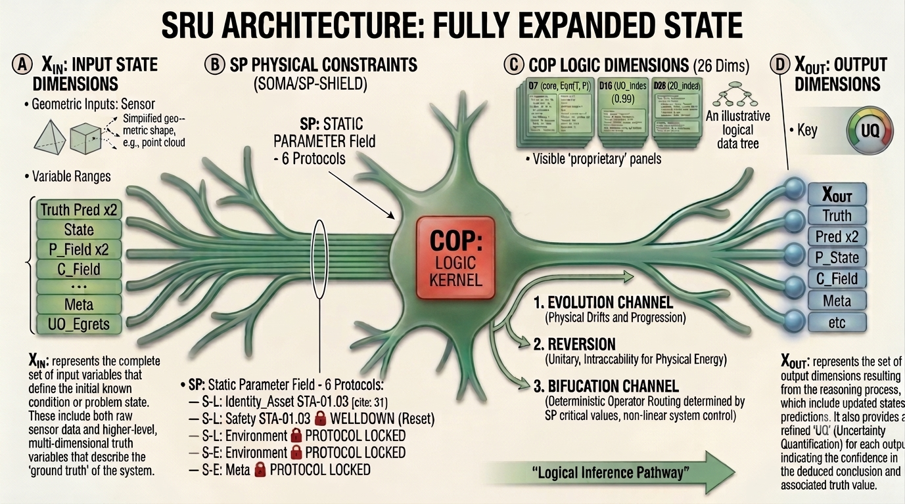

# The Ontological Fault Between Physical Science and AI/实体科学与人工智能的“本体论断层”

::: {#fig-paradigm}
{width=80%}

**The Ontological Conflict in Computational Science. This schematic illustrates the fundamental divergence between probabilistic language model outputs (left) and deterministic physical axioms (right). The central fault line represents the current limitation of AI-driven research: the inability to preserve invariant physical laws through stochastic sampling, necessitating an axiomatic structural correction.**
:::

::: {.panel-tabset}
### English
In the wake of the AI for Science (AI4S) revolution, we are confronting a profound paradigm crisis: the attempt to define necessary laws through probabilistic sampling.

Large Language Models (LLMs) operate on autoregressive conditional probability sampling within high-dimensional semantic spaces, exhibiting remarkable emergent properties in heuristic text processing and unstructured information sorting. This technological wave has naturally catalyzed the academic ambition to restructure scientific discovery through data-driven methodologies. However, when the autoregressive paradigm is directly deployed to address complex Scientific, Technological, and Engineering Events (STE Events)—particularly those involving multi-physics domain coupling, long-range causal chain extrapolation, and the engineering design of complex multiphase systems—the system demonstrates a fundamental paradigm stall.

An irreconcilable ontological fault exists between the axiomatic system of physical science and the nature of pure semantic generative models. The evolutionary trajectory of physical science is strictly governed by local invariants, dimensional homogeneity, and deterministic conservation laws (First Principles); conversely, autoregressive models are, in essence, conditional probability samplers residing on probabilistic manifolds. While Physics-Informed architectures have demonstrated initial physical compatibility in solving specific differential equations [@raissi2019; @karniadakis2021], their structural limitations in complex, long-chain reasoning remain significant. In the absence of rigid physical constraints during long-chain mechanistic derivation, microscopic disorder entropy within the semantic space cascades forward along the autoregressive chain, causing the evolutionary trajectory to deviate rapidly from the legitimate physical submanifold, thereby inducing uncontrollable hallucinatory divergence.

### 中文
在 AI 驱动科学发现（AI4S）的浪潮中，我们正面临一次范式危机：我们试图用“概率的采样”去定义“必然的规律”。

大语言模型（LLM）基于高维语义空间内的自回归条件概率采样，在启发式文本处理与非结构化信息分拣中表现出了显著的涌现特性。这一技术浪潮自然引发了学术界对“数据驱动型科学发现（AI for Science, AI4S）”的重构尝试。然而，当自回归范式被直接引入处理复杂的科学技术工程事件（STE Events）——尤其是涉及多物理域交联、长跨度机理因果链条外推以及多相复杂体系工程设计时——系统表现出了根本性的范式失速。

实体科学体系与纯语义生成模型之间存在着难以调和的本体论断层。实体科学体系的演化轨迹严格受控于定域不变量、量纲齐次性以及确定性的守恒定律（第一原理）；而自回归模型在本质上属于概率流形上的条件概率采样器。尽管 Physics-Informed 架构在特定微分方程求解中展示了初步的物理兼容性 [@raissi2019; @karniadakis2021]，但其在复杂长链推理中的结构性局限依然显著。在缺乏刚性物理约束的长链机制推导中，语义空间内的微观无序熵将沿着自回归链路向前级联累积，导致系统演化轨迹迅速偏离合法的物理子流形，诱发不可控的幻觉发散。
:::

# The Theoretical Crisis of Current AI4S Paradigms / 当前 AI4S 范式的理论危机 {#sec-2}

::: {#fig-paradigm-crisis}
{width=85%}

**Geometrical Manifestation of the Ontological Fault in Current AI4S Paradigms.** The diagram illustrates the divergence between the rigid Physical Manifold (bottom blue surface), defined by fundamental continuous invariants (e.g., $\nabla \cdot \mathbf{J} = 0$), and the fragile Semantic Manifolds (top red surface). (Left) Fine-Tuning induces local weight warping and non-linear stress near non-equilibrium boundaries, leading to structural stiffness loss and pseudo-truth hallucinations. (Right) RAG introduces discrete, heterogeneous scholarly chunks that fail to maintain dimensional consistency, causing splicing fractures. The persistent gap between these two layers constitutes the Ontological Fault, which fundamentally precludes the reliability of these models during long-chain extrapolation, inevitably culminating in catastrophic logical collapse.
:::

::: {.panel-tabset}
### English
## The Limitation of Fine-Tuning and RAG
When confronting the challenge of probabilistic hallucinations, contemporary methodologies relying on localized knowledge Fine-Tuning and Retrieval-Augmented Generation (RAG) invariably fail to touch the underlying causal foundations, remaining merely superficial semantic decoration paradigms.

**2.1.1 The Ineffectiveness of Knowledge Fine-Tuning**
Fine-tuning operates by locally warping the model's weight space to fit domain-specific corpora; yet, it remains fundamentally incapable of rewriting the conditional probability nature of autoregressive sampling. While Physics-Informed (PI) architectures have demonstrated initial physical compatibility in solving specific differential equations [@raissi2019; @karniadakis2021], their structural reliance on specific training distributions limits their generalization. Research indicates that while models can be adapted to specific tasks, they struggle to generalize internal structural rules to entirely new scientific regimes [@Kirsch2022]. When encountering cutting-edge scientific mutation points or extreme non-equilibrium boundaries that never surfaced in the training set, the non-linear collapse of its high-dimensional weights frequently induces more covert and perilous pseudo-truth hallucinations.

**2.1.2 The Structural Limitations of the RAG Paradigm**
RAG relies on semantic similarity metrics to bridge knowledge gaps, a technique primarily designed for natural language fluency rather than rigorous scientific inference [@Lewis2020]. Absent the constraints of a continuous causal flow, what the system executes within the context window is essentially a brute-force probabilistic splicing of scholarly building blocks. This semantic decoration paradigm is inherently incapable of blocking the cascading amplification of errors, inevitably crashing into logical cliffs during long-chain cascade.

### 中文
## 2.1 微调（Fine-Tuning）与检索增强生成（RAG）的局限性{.unnumbered style="color: inherit; font-size: 1.2em;"}
在面对概率性幻觉的挑战时，当代依赖局部知识微调（Fine-Tuning）和检索增强生成（RAG）的方法论，始终无法触及科学的底层因果基础，本质上仍停留在肤浅的语义装饰范式层面。

**2.1.1 知识微调的局限性**
微调通过局部扭曲模型的权重空间以适配特定领域的语料库；然而，它在本质上无法重写自回归采样固有的条件概率性质。尽管“物理信息机器学习（Physics-Informed ML）”架构在求解特定微分方程方面展示了初步的物理兼容性 [@raissi2019; @karniadakis2021]，但其对特定训练分布的结构性依赖限制了模型的泛化能力。研究表明，尽管模型可以针对特定任务进行适配，但它们难以将内隐的结构规则推广至全新的科学范式 [@Kirsch2022]。当遇到训练集中从未出现的科学突变点或极端非平衡边界时，其高维权重的非线性坍缩往往会诱发更隐蔽、更危险的伪真幻觉（pseudo-truth hallucinations）。

**2.1.2 RAG 范式的结构性缺陷**
RAG 依赖语义相似度指标来弥合知识鸿沟，这主要是一种针对自然语言流畅度设计的技术，而非针对严谨的科学推理 [@Lewis2020]。在缺乏连续因果流约束的情况下，系统在上下文窗口内执行的操作本质上是对学术知识块的暴力概率拼接。这种“语义装饰”范式在本质上无法阻止错误的级联放大，必然会在长跨度外推的过程中撞上逻辑断崖（logical cliffs）。
:::

## The Complexity Barrier and Environment Flipping: Failure of Brute-Force Scaling

::: {#fig-complexity-barrier}
{width=85%}

 Computational Complexity Barrier and Environment Flipping Points in Brute-Force Scaling. This visualization highlights the failure of empirical generative models during long-chain extrapolation. (Left) The amplification of microscopic token noise into macro-chaos demonstrates the absence of rigid algebraic constraints, leading to the collapse of inferential trajectories. (Right) The "Environment Flipping Point" illustrates how static probabilistic models fail to capture non-linear phase bifurcations (e.g., thermodynamic mutations, topological folding), resulting in catastrophic structural breakdown. The global reliance on brute-force scaling inherently lacks the ability to preserve constitutive physical relations, precluding reliable scientific discovery at scale.
:::

::: {.panel-tabset}
### English

The exhaustivist school, which advocates for the brute-force mitigation of hallucinations through the infinite expansion of context windows or the deployment of multi-agent consensus algorithms, inevitably collides with two insurmountable mathematical barriers when confronting cross-domain, long-chain extrapolation:

**2.2.1 The Computational Complexity Barrier**
Devoid of local, hard-coded algebraic encodings from conservation laws, microscopic token sampling noise amplifies geometrically as the causal chain extends and derivation steps multiply. Rather than dampening these errors, multi-agent systems introduce cascading accumulations of global disorder entropy due to the semantic friction of heterogeneous prompts during agent interactions. This structural breakdown causes the system’s inference trajectory to instantaneously deviate from the legitimate physical sub-manifold [@mialon2023].

**2.2.2 Environment Flipping Points and Irreproducible Fractures**
Empirical scientific and engineering events are universally characterized by non-equilibrium environmental state transitions. As the inferential derivation advances toward the intersection of multi-scale, multi-physics manifolds (e.g., topological folding of continuous media or sharp thermodynamic mutations), the physical constitutive relations undergo abrupt, non-linear bifurcations. Bound by static empirical probabilities, conventional generative models are inherently incapable of analytically formalizing such phase-space bifurcations. Consequently, the entire extrapolated causal chain experiences a catastrophic logical stalling and total structural collapse immediately following the environment flipping point [@strogatz2018].

### 中文
## 计算复杂度壁垒与环境翻转点：暴力缩放范式的失效 {.unnumbered style="color: inherit; font-size: 1.2em;"}

“穷举派”（Exhaustivist school）主张通过无限扩展上下文窗口或部署多智能体共识算法来强制平抑幻觉，然而在面对跨领域、长链条的外推任务时，该范式不可避免地会触碰两道难以逾越的数学壁垒：

**2.2.1 计算复杂度壁垒**
由于缺乏守恒定律提供的底层硬编码代数约束，随着因果链的延伸和推导步骤的累加，微观上的标记（token）采样噪声会呈现几何级增长。多智能体系统不仅无法抑制这些误差，反而因异构提示词（prompts）交互时产生的“语义摩擦”（semantic friction），导致全局无序熵（global disorder entropy）出现级联累积。这种结构性的失稳使得系统的推理轨迹瞬间偏离了合法的物理子流形（physical sub-manifold），使得输出结果在耗费巨额算力的同时，却失去了物理意义[@mialon2023]。

**2.2.2 环境翻转点与不可重现的断裂**
实验科学与工程事件普遍具有非平衡态环境转换的特征。随着推理推导向多尺度、多物理场流形的交汇处推进（例如连续介质的拓扑折叠或剧烈的热力学变异），物理本构关系会经历突发的、非线性的分岔（bifurcations）。由于受限于静态的经验概率，传统的生成式模型本质上无法解析地形式化这种相空间分岔。因此，整个外推的因果链会在经过“环境翻转点”（environment flipping points）后，立即经历灾难性的逻辑停滞与整体结构坍缩，这是静态训练数据根本无法捕捉的动力学体制突变[@strogatz2018]。
:::

# The Logic-First Paradigm and the Constraints of Causality Flow

::: {#fig-aletheia-architecture}
{width=85%}

The Aletheia Symbiotic Architecture. A dual-track computational framework for scientific discovery. The system features a Kinetic Soft-Core (LLM) that provides semantic fluency and heuristic exploration, encapsulated by a Hard-Constraint Compiler Motherboard. Causal flow generated by the soft core is subjected to real-time physical adjudication (Adjudication Gate), where algebraic conservation laws and constitutive equations act as the ultimate falsifiability filter. Divergent logical paths are intercepted by the Circuit Breaking mechanism, ensuring that all valid inferences remain restricted to the physical submanifold.
:::

::: {.panel-tabset}
### English

To properly analyze the physical essence of scientific discovery and mechanistic extrapolation, we must establish two fundamental ontological tenets: the "Logic-First" paradigm and "Causality Flow." These principles serve as the ultimate criteria for verifying the consistency of long-chain inference within human-AI symbiotic systems.

**3.1 The Logic-First Paradigm and Scientific Falsifiability**
In the empirical realm of physical sciences, material evolution and phase transitions are not governed by the accumulation of empirical probabilities, but are strictly controlled by underlying symbolic logic and algebraic equations. We define these symbolic logic and algebraic conservation laws as the system’s "Axiomatic Constraints."

*   **Noetherian Constraints on Determinism**: According to Noether's Theorem, every continuous symmetry corresponds to a conserved quantity. Phase transitions are fundamentally deterministic evolutionary processes governed by energy minimization principles (Gibbs Free Energy) and symmetry breaking. If a model neglects symmetry conservation, its output is dynamically "blind."
*   **Hard Boundaries of Constitutive Equations**: Constitutive relations (e.g., Navier-Stokes equations) define the physical boundaries of system evolution and hold higher priority than any empirical observation. Any time-stepping that violates these relations is inherently "unphysical."
*   **Symplectic Topological Closure**: Scientific computation must preserve the symplectic structure of the phase space. Utilizing Symplectic Integrators to maintain topological invariance is a fundamental technical requirement to prevent the divergence of long-chain inference due to numerical dissipation.

From the ontological perspective of causal inference, deterministic governing equations reside at the apex of the causal hierarchy—the counterfactual layer within Structural Causal Models (SCMs) [@pearl2009]. Furthermore, according to Karl Popper, scientific knowledge is defined by its local falsifiability [@popper1963]. A valid scientific reasoning system must possess an "underlying adjudication" mechanism, triggering rigid circuit breaking when logical chains violate fundamental physical laws.

**3.2 The Dynamical Characteristics of Causality Flow**
Causal propagation exhibits the characteristics of a continuous "Flow" governed by fluid-like dynamics. The output of an antecedent causal operator is strictly mapped to the physical input slots of subsequent operators. From the perspective of non-equilibrium thermodynamics, the convergence of information within a causal mesh is a dissipative structural evolution process, wherein the system state vector monotonically approaches a low-energy attractor [@glansdorff1971]. Consequently, causality flow must globally satisfy local energy dissipation and monotonic entropy reduction, while being locally restricted by the rigid algebraic locking of dimensional Abelian groups.

**3.3 The Original Sin of the Probabilistic Paradigm**
The "probability-first" architectures prevalent in contemporary AI attempt to utilize linguistic semantic similarity as a proxy for physical causal necessity, degrading constrained flow into a chaotic random walk within a probabilistic mire. Because autoregressive models lack engineering countermeasures to reflect Popperian falsifiability, microscopic token noise remains unintercepted. The correct evolutionary trajectory is a "symbiotic reconstruction": leveraging LLMs as the system’s "kinetic heart," while externally engineering a first-principles compiler motherboard as the "skeletal guide and guidance grid."

### 中文
## 3 第一原理批判：逻辑为先与因果流的机制约束 {.unnumbered style="color: inherit; font-size: 1.2em;"}

审视科学发现与机理外推的物理本质，必须确立“逻辑为先（Logic-First）”与“因果流（Causality Flow）”两项基础的本体论铁律，以此作为评估长链推理自洽性的终极判定基准：

**3.1 逻辑为先与科学的可伪证性**
在实体科学的客观世界中，物质的演化与相变绝非由经验概率的堆砌决定，而是受控于底层冷酷的符号逻辑与代数方程。我们将符号逻辑与代数守恒律定义为系统的“上位法（Axiomatic Constraints）”。

*   **物理决定论的诺特约束**：根据诺特定理（Noether's Theorem），每一个连续对称性对应一个守恒量。相变本质上是系统在对称性破缺与 Gibbs 自由能最小化原理下的确定性演化。若模型忽视对称性守恒，其输出在动力学上即为“盲目”。
*   **本构关系的硬性边界**：本构方程（如纳维-斯托克斯方程）是系统演化的边界，其优先级高于任何经验观测。任何违背本构关系的步进在数值计算中均属“非物理的”。
*   **辛拓扑的闭环稳定性**：科学计算必须维持相空间的辛结构。通过辛积分算法实现拓扑不变性，是保障长链推理不因数值耗散而发散的核心技术要求。

从数理本体审视，物理不变量的确定性控制方程处于因果关系梯度的最高层——即 SCMs 中的反事实层（Counterfactual Layer） [@pearl2009]。依据卡尔·波普尔（Karl Popper）的科学哲学，科学知识的本质在于其定域可伪证性 [@popper1963]。因此，科学推理系统必须具备“底层审判”机制，当逻辑链触及物理不可能性时，系统必须触发硬性断路（Circuit Breaking）。

**3.2 因果流的动力学特征**
因果传导表现为具备连续流体动力学特征的“流（Flow）”。前驱因果算子的输出严格映射为后继算子的物理输入槽位，形成定向、有时序耗散性的逻辑动能传导。从非平衡态热力学视角看，信息在因果网格中的收敛，是一个系统状态矢量在确定性边界约束下，向低能量吸引子单调逼近的耗散结构演化过程 [@glansdorff1971]。因此，因果流在宏观上必须满足定域能量耗散与单调熵减纪律，且在微观上受制于量纲阿贝尔群的不变性刚性约束。

**3.3 概率范式的原罪**
当代 AI 采用的“概率为先”架构，本质上是试图用语义邻近度代理物理因果必然性，将高维流形上的受限流退化为概率泥潭中的随机游走。由于自回归模型无法显式表达因果流的连续动力学，且缺乏对应 Popperian 证伪的硬熔断机制，微观 Token 噪声无法被守恒律泛函拦截。AI4S 的正确演化方向在于“共生重构”：以 LLM 作为系统的“动力心脏”，但必须外部耦合一套基于第一原理的编译器母板，作为系统的“骨架与引导网格”。
:::

# Symbiotic Reasoning Unit (SRU) —— —— Axiomatic Dynamical Unit of Scientific Reasoning/科研推演的公理化动力学单元

::: {#fig-sru-dynamics}
{width=85%}

Comparative Dynamics of Scientific Reasoning: Probabilistic Interpolation vs. Deterministic Causal Evolution. The left panel depicts the "Probabilistic Fog" inherent in current Large Language Models, where inference chains suffer from semantic drift and cumulative physical hallucinations due to the absence of external constraints. The right panel illustrates the "Deterministic Causal Evolution" mediated by the proposed Scientific Reasoning Units (SRUs). By integrating the Logic-First principle, SRU architecture employs explicit Constraint Operators (COP) to perform logic renormalization at each step, ensuring the reasoning trajectory remains rigidly anchored to the physical manifold ($\mathcal{M}$) and adheres to fundamental conservation laws.
:::

::: {.panel-tabset}
### English
## Why SRU: A Return to the "First Principles" of Physical Logic
The ultimate goal of scientific research is physical reality, not merely the self-consistency of logical symbols. Current AI paradigms for science are trapped in a "semantic snare": they attempt to fit knowledge through probabilistic prediction while losing the fundamental constraints of the material world. To reconstruct the foundation of scientific reasoning, we establish the "Logic-First" principle and, based on this, introduce the SRU (Scientific Reasoning Unit).

**4.1.1 Evolution of the Physical Phase Space, Not Probabilistic Interpolation in Semantic Space**
The essence of current Large Language Models (LLMs) is the statistical fitting of discrete symbol sequences. Their inference logic seeks the "highest probability" token path rather than the "physically authentic" evolutionary trajectory. This "probabilistic smoothing" leads to:
*   **Semantic Drift**: Due to the lack of an anchor in an external physical reference frame, logical evolution easily deviates from the defined physical field.
*   **Physical Hallucination**: Knowledge acquired through implicit weight fitting fails to comprehend hard constraints (e.g., conservation laws, dimensional consistency), generating "plausible but unphysical" conclusions.

**4.1.2 From the "Fog" of Probability to the "Rails" of Causality**
Scientific deduction requires **Causal Closure**: every step of the reasoning chain must reside within the descriptive bounds of a physical system. The mission of the SRU is to liberate scientific deduction from the "fog" of probability and place it upon the "rails" of physical law. We construct a physical operator protocol ensuring that every inference step is calibrated by physical conservation operators, guaranteeing deterministic evolution within the phase space $\mathcal{M}$.

**4.1.3 Paradigm Shift: From "Weight Fitting" to "Logic Compilation"**
*   **Implicit Fitting $\to$ Explicit Logic Compilation**: We explicitly encode scientific laws as SRU operator protocols rather than compressing them into weight matrices, ensuring **Auditability** and **Determinism**.
*   **Atomization of Computation**: By decomposing scientific reasoning into the SRU—the smallest physical unit—we reduce computing to fundamental operator interactions, constructing complex topologies while rigorously protecting physical authenticity.

### 中文
## 4.1 为什么要推出 SRU：物理逻辑的“第一性”回归 {.unnumbered style="color: inherit; font-size: 1.2em;"}
科学研究的终点是物理实相（Physical Reality），而非仅仅是逻辑符号的自洽（Logical Consistency）。当前的科研人工智能体系正深陷于一种“语义陷阱”中：它们通过概率预测来拟合知识，却在推演过程中丢失了物质世界最基础的约束。为了重构科学推理的基石，我们确立了“逻辑为先（Logic-First）”这一核心原则，并基于此推出了 SRU (Scientific Reasoning Unit)。

**4.1.1 物理相空间的演化，而非语义空间的概率插值**
现有大语言模型（LLM）的本质是对离散符号序列的统计拟合，其逻辑是寻找“概率最大”的 Token 路径而非“物理最真实”的演化轨迹。这种“概率平滑”导致了：
*   **语义漂移（Semantic Drift）**：因缺乏外部物理参考系的锚定，逻辑演化极易偏离初始定义的物理场，产生不可控的“漂移”。
*   **物理幻觉（Physical Hallucination）**：隐式拟合的知识无法理解守恒律、量纲一致性等硬约束，极易生成看似符合逻辑、实则违反物理常识的结论。

**4.1.2 从概率“迷雾”回归因果“铁轨”**
科学推演的核心在于**因果闭合（Causal Closure）**：科学推理的因果链必须在演化之初即被设定为闭合，而非在概率空间中事后修正。SRU 的核心使命，是将科研推演从概率的“迷雾”中解放出来，置于物理定律的“铁轨”之上。通过构建物理算子协议，SRU 确保推理的每一环节必须通过物理守恒算子的校准，保证其本质是在相空间 $\mathcal{M}$ 内进行的确定性演化。

**4.1.3 范式转变：从“权重拟合”到“逻辑编译”**
*   **隐式拟合 $\to$ 显式逻辑编译**：我们不再将科学规律揉碎在神经网络的权重矩阵中，而是将其显性编码为 SRU 的算子协议，使得科研推演具备了可审计性（Auditability）与确定性（Determinism）。
*   **计算基元的原子化**：将科研推理拆解为 SRU 这一最小物理单元，将科学计算还原为最基础的算子交互。通过 SRU 的级联构建极其复杂的科研推理拓扑，物理本真始终受到严密保护。
:::

## The Fundamental Structure of SRU: The "Minimal Universal Unit" of Scientific Calculation/SRU 的基本构成：科学演算的“最小唯一单元”

::: {#fig-sru-architecture}
{width=85%}

Architecture of the Aletheia Scientific Reasoning Unit (SRU): A Cluster-to-Convergence Engine. The comprehensive architecture of the SRU, functioning as the minimal universal unit of scientific logic. The unit transforms high-uncertainty input states ($X_{IN}$) into refined, converged scientific conclusions ($X_{OUT}$) through a deterministic topology. Key components include: the Problem Definition & Logical Compilation phase; the Causal Operator (COP), which enforces "Logical Iron Laws"; and the Static Parameter Fields (SP), which define the constrained manifolds necessary for entropy-reduction flow. By utilizing Dimensional Auditing and Bifurcation Channels, the SRU ensures that each reasoning step remains anchored within the physical manifold, effectively mapping divergent input clusters to precise, traceable, and physically consistent scientific outcomes.
:::

::: {.panel-tabset}
### English
Scientific deduction should not rely on the "mysticism" of emergence, but rather be built upon deterministic primitives. The **Scientific Reasoning Unit (SRU)** is defined as the minimal universal unit of scientific logic. It serves as the "atom" of scientific computing and the sole logical foundation for constructing complex causal systems.

**4.2.1 Minimal Completeness: The Boundary of Causal Closure**
The SRU is considered the "minimal" unit because it achieves full-dimensional closure in scientific reasoning. Stripped of all irrelevant linguistic semantics, a scientific reasoning step must contain three indispensable elements:
* **Input State ($X_{IN}$)**: The initial scientific state carrying high inherent uncertainty.
* **Physical Kernel (COP)**: The "Logical Iron Laws" that enforce physical conservation principles.
* **Parameter Constraint (SP)**: The physical baseline defining the potential energy surface for deduction.

Any decomposition finer than the SRU leads to a fracture in the physical causal chain. Conversely, any complex reasoning structure is essentially a cascading topology of SRUs.

**4.2.2 Uniqueness: The Dynamic Primitive of Scientific Computing**
The SRU departs from probabilistic statistical simulation, functioning as a true **Cluster-to-Convergence Engine**:
* **Operator as Logic**: Employs **COP: CAUSAL OPERATOR** to lock the input logic, ensuring the reasoning trajectory remains drift-free.
* **Dynamic Evolution**: Inference is a deterministic path-planning exercise based on physical laws, not a statistical combination of text.
* **Auditable Finality**: Output is a **REFINED PREDICTION**, where every **PRODUCT SPECIFICATION** possesses traceable **DATA PROVENANCE**.

**4.2.3 Why Scientific Deduction Must Be a Chain of SRUs?**
By decomposing problems into an SRU topology, we build a "Logical-Physical Computer":
1.  Each SRU is responsible for the constraint of a specific local conservation law.
2.  The overall reasoning process is a synergistic mapping of these SRU units within the physical phase space.
3.  Conclusions converge not through "learning" patterns, but because the logical path is forcibly anchored to the manifold of physical reality by COP operators.

### 中文

科研推理单元（SRU）被定义为科研逻辑的最小唯一单元。它是所有科学计算的“原子”，也是构建复杂因果系统的唯一逻辑基石。

**4.2.1 最小完备性：因果闭合的边界**
SRU 之所以是“最小”单元，是因为它在逻辑上实现了科研推理的全维度闭合。一个科研推理步骤必须包含三个要素才能存在，缺一不可：
* **数据输入 ($X_{IN}$)**：承载高不确定性的初始科学状态。
* **物理内核 (COP)**：强制执行物理守恒律的“逻辑铁律（Logical Iron Laws）”。
* **参数约束 (SP)**：定义推演势能面的“物理基准”。

任何比 SRU 更细碎的切分，都会导致物理因果链的断裂；而任何更复杂的推理结构，本质上都是 SRU 在空间拓扑上的级联。

**4.2.2 唯一性：科学计算的动力学基元**
SRU 的唯一性在于，它彻底废弃了基于概率分布的统计模拟，转向了真正的动力学引擎（Cluster-to-Convergence Engine）：
* **算子即逻辑**：通过 **COP: CAUSAL OPERATOR** 对输入进行逻辑锁死，确保推演路径不产生漂移。
* **动力学演化**：推理过程不是对文本的统计组合，而是基于物理定律的确定性路径规划。
* **可审计的终态**：SRU 的输出是 **REFINED PREDICTION（精确预测）**，其每一个 **PRODUCT SPECIFICATION（结论规格）** 都具有可追溯的 **DATA PROVENANCE（数据溯源）**。

**4.2.3 为什么科学推演只能是 SRU 的连接？**
当我们将科学问题拆解为 SRU 拓扑结构时，我们实际上是在搭建一台“逻辑物理计算机”：
1.  每个 SRU 负责一个局部守恒律的约束。
2.  整体推理过程即是这些 SRU 单元在物理相空间中的协同映射。
3.  最终结论收敛不是因为模型“学到了”规律，而是因为逻辑路径被 COP 算子强制锚定在了物理现实的流形之上。
:::

## The Intellectual Genealogy: Academic Origins of the SRU/理论谱系：SRU 的学术基因

::: {.panel-tabset}
### English
The SRU architecture ($X_{IN} / COP / SP / X_{OUT}$) is grounded in established scientific paradigms. By reconstructing three classical theoretical frameworks, it systematically calibrates the logical distortions inherent in current AI research, enabling a fundamental shift from "probabilistic simulation" to "scientific computation."

**4.3.1 Cybernetic Feedback: Hard-Constraint Realization**
* **Academic Origin**: Feedback Control Theory.
* **SRU Reconstruction**: Conventional AI reasoning often flounders in infinite noise-driven feedback. The SRU introduces the **SP (Static Parameter Field)** as a "rigid boundary," transforming the vague feedback environments of traditional cybernetics—as established by [@Wiener2020]—into explicit constraint spaces. This ensures that the state transition path ($X_{IN} \rightarrow X_{OUT}$) remains immune to divergent environmental noise, achieving steady-state control in scientific deduction.

**4.3.2 Structural Causal Models (SCM): Scientific Semantic Mapping**
* **Academic Origin**: Causal Inference Framework.
* **SRU Reconstruction**: Current LLMs frequently conflate "correlation" with "causation." The SRU defines **SP** as Exogenous Invariants and **COP** as Structural Equations, following the causal inference framework pioneered by [@pearl2009]. This explicit mapping mechanism enforces adherence to the causal chains of scientific structures. By instantly triggering a "logic lock" whenever a causal direction violates physical laws, the architecture fundamentally precludes the generation of "pseudo-causal" conclusions.

**4.3.3 Phase Space Dynamics: Path Locking via Topological Manifolds**
* **Academic Origin**: Nonlinear Dynamics.
* **SRU Reconstruction**: We conceptualize the reasoning process as vector field motion within the phase space $\mathcal{M}$. Drawing from the nonlinear dynamics frameworks of [@Wiggins2003] and [@strogatz2018], the **SP** functions as **Invariant Manifolds**, acting as guardrails that "lock" logic into legitimate energy potential wells. This design ensures that the terminus of any scientific deduction remains strictly within the bounds permitted by physical law, geometrically preventing the occurrence of "unscientific" semantic drift.

### 中文

SRU 架构并非无本之木，它通过对三大经典理论范式的现代重构，从根源上校准了科研 AI 的逻辑失真问题，实现了从“概率模拟”到“科学计算”的跨越。

**4.3.1 控制论：维纳反馈闭环的“硬约束”化 (Cybernetic Feedback)**
* **学术渊源**：反馈控制理论。
* **SRU 重构**：传统 AI 推理往往沉溺于无尽的噪声反馈，导致系统不稳定。SRU 引入 **SP（系统参数场）** 作为系统的“刚性边界”，将维纳 [@Wiener2020] 所奠定的模糊反馈环境转化为显性的约束空间。这种设计确保了状态转移路径 ($X_{IN} \rightarrow X_{OUT}$) 不会因为环境噪声的扰动而发散，实现了科研推演中的稳态控制。

**4.3.2 因果科学：珀尔框架的“科学语义”映射 (SCMs)**
* **学术渊源**：因果推断框架。
* **SRU 重构**：现有 LLM 往往混淆了“相关性”与“因果性”。SRU 将 **SP** 定义为外生不变变量，将 **COP** 定义为结构方程，这遵循了 [@pearl2009] 开创的因果推断框架。这种显式的映射机制，强制推演路径必须遵循科学结构的因果链路。通过在违反物理定律时触发“逻辑锁定”，系统从根源上断绝了 AI 生成“伪因果”结论的可能性。

**4.3.3 动力系统：相空间拓扑的“路径锁定” (Phase Space Dynamics)**
* **学术渊源**：非线性动力学。
* **SRU 重构**：我们将推演过程视作相空间 $\mathcal{M}$ 上的向量场运动。借鉴 [@Wiggins2003] 与 [@strogatz2018] 的框架，SRU 中的 **SP** 充当了“不变流形（Invariant Manifolds）”，如同护栏一般将推理逻辑“锁定”在合法的能量势阱内。这种设计确保了科研推演的终点始终处于科学定律允许的范围内，从几何动力学的维度杜绝了“非科学”语义漂移的发生。
:::

## Operational Dynamics: Folded and Expanded States/运行动力学：折叠态与展开态的切换

::: {.panel-tabset}
### English

The computational efficiency of the SRU is derived from its unique **"Folded-Expanded Meta-Architecture."** This mechanism enables a dynamic shift between the "Full-Chain Cruise" of logical structures and the "Precision Resolution" of scientific computation.

**4.4.1 Folded State: Full-Chain Cruise and Logical Connectivity**

::: {#fig-sru-folded}
{width=85%}

SRU Architecture: Folded State for Full-Chain Logical Cruise. The SRU in its "Folded State", operating as a lightweight logic primitive during the system cruise phase. In this state, the architecture focuses exclusively on the orchestration of topological connectivity and the pre-deployment of the logical full-chain, maintaining minimal computational overhead while ensuring the structural integrity of the causal network before active computation.
:::

During the cruise phase, the SRU remains in a folded state, aiming for the architectural orchestration of large-scale logic circuits:

* **Structural Networking**: The system exists as highly compressed primitives. At this stage, SRUs with different functionalities are interconnected based on logical connectivity to form a "Logical Full-Chain" that covers the entire scope of the scientific problem.
* **Principle of Silence**: In the folded state, the system only performs the construction and verification of topological relationships and, in principle, does not initiate core computational power consumption.
* **Low-Energy Deployment**: This design allows complex scientific models to be pre-deployed in physical space as "lightweight logic graphs," significantly reducing system load.

**4.4.2 Expanded State: Precision Computation and Robustness Evaluation**

::: {#fig-sru-expanded}
{width=85%}

SRU Architecture: Fully Expanded State for Precision Physical Resolution. he SRU in its "Fully Expanded State", activated for precision computation, robustness evaluation, or digital twin simulation. Upon triggering, the architecture undergoes a full-dimensional expansion of the four-factor quartet ($X_{IN}$, COP, SP, and $X_{OUT}$), engaging the Logic Kernel to execute deterministic, non-linear evolutionary mapping constrained by fundamental physical laws.
:::

Once the full chain is constructed, the system enters the requirement-oriented expansion phase:

* **Full-Dimensional Expansion**: When deep analysis is required, the system fully expands, activating all dimensions: $X_{IN}$, $COP$, $SP$, and $X_{OUT}$.
* **Computational Reconstruction**: Leveraging massive AI power and rigorous **Evolution Channels**, the system executes non-linear deduction ensuring strict dimensional accuracy.
* **Computational Closed-Loop**: After exporting the **REFINED PREDICTION**, the system automatically retracts power, folding back into the cruise state to ensure physical consistency.

This mechanism transforms AI into an "on-demand physical computer," resolving computational bottlenecks via a "connect-first, compute-later" mode.

### 中文

SRU 的核心计算效能源于其独特的“折叠-展开”元架构 (Folded-Expanded Meta-Architecture)。这种机制实现了逻辑结构的“全链巡航”与“精细化解算”之间的动态切换。

**4.4.1 折叠态（Folded State）：全链巡航与逻辑连接**

在巡航阶段，SRU 处于折叠态，旨在实现大规模逻辑回路的架构编排：

* **结构组网**：系统以高度压缩的基元形式存在，通过逻辑可连接性构成“逻辑全链”。
* **原则性静默**：仅进行拓扑关系的构建与校验，原则上不启动核心算力消耗，维持必要的接口协议。
* **低能耗部署**：将复杂模型以“轻量级逻辑图”预部署，极大降低系统负载。

**4.4.2 展开态（Expanded State）：精细化运算与鲁棒评价**

当全链完成构建，系统进入需求导向的展开阶段：

* **全维度展开**：系统全面展开，激活包括 $X_{IN}$（输入）、$COP$（逻辑内核）、$SP$（参数约束）及 $X_{OUT}$（输出）在内的所有维度。
* **算力重构**：依托严谨的科学导轨（Evolution Channel）执行深度推演，确保精度符合科学量纲要求。
* **计算闭环**：导出 **REFINED PREDICTION（精确预测）** 后，系统自动回笼算力并折叠回巡航态，仅存储关键参数。

这种机制将 AI 从“盲目的大模型运算”转型为“按需调用的物理计算器”，完美解决了多尺度建模中的算力瓶颈。
:::

## SRU Core Advantages: The Benchmark for Scientific Reasoning/SRU 核心优势：科研推理的基准

::: {.panel-tabset}
### English
SRU transforms scientific AI from "probabilistic generation" to "scientific computation." Its core advantages are summarized as follows:

* **Zero-Drift**: Through the immutable COP (Logic Kernel) iron rules, the system maintains scientific consistency throughout long-chain deductions, completely eradicating semantic drift and scientific hallucinations.
* **Computational Efficiency**: Utilizing an "on-demand expansion" mechanism, the system triggers full-dimensional activation only during critical resolution moments, bypassing the energy waste and logical noise inherent in full-chain probabilistic computation.
* **Auditability**: Reasoning paths are mapped within the physical phase space, ensuring the entire process is fully traceable and finally resolving the "black-box" credibility dilemma in scientific decision-making.
* **Topological Composability**: Standardized interface protocols allow SRU units to be cascaded like building blocks, supporting logical networking from singular conservation law deductions to complex multi-coupling systems.
* **Scientific Adaptivity**: The architecture supports real-time re-mapping of potential energy surfaces under dynamic experimental conditions, ensuring robust reasoning within evolving scientific scenarios.

### 中文

SRU 将科研 AI 从“概率生成”转型为“科学计算”，其核心优势可概括为：

* **零漂移 (Zero-Drift)**：通过 COP 逻辑铁律，在长链条推演中维持科学一致性，彻底根除语义漂移与科学幻觉。
* **算力聚焦 (Computational Efficiency)**：采用“按需展开”机制，仅在关键解算时刻激活全维度，规避全链概率计算带来的能耗与逻辑噪声。
* **因果全透明 (Auditability)**：推理路径基于物理相空间映射，全过程可追溯，终结了科研决策中的“黑盒”不可信难题。
* **拓扑组合性 (Topological Composability)**：标准化的接口协议允许 SRU 单元如积木般级联，支持从单一守恒律到复杂多耦合系统的逻辑组网。
* **科学自适应性 (Scientific Adaptivity)**：支持在动态实验场景下实时重映射势能面，确保在复杂科学演变中保持推理的实时稳健性。
:::

# Ongoing Work: The ALETHEIA Evolution Strategic Roadmap/进行中的工作：ALETHEIA 演进战略路线图

::: {.panel-tabset}
### English

“Project Aletheia” is consolidated into the **ALETHEIA Scientific Intelligence Pipeline**, a platform shifting scientific discovery from human-orchestrated inquiry to system-driven axiomatic resolution. Our development focuses on three primary vectors:

1.  **Axiomatic Resonance Spaces (Theory)**: We are transitioning from traditional high-dimensional semantic representations toward a unified **Axiomatic Resonance Space**. In this framework, SRUs operate as coherent entities, reorganizing based on physical invariants rather than stochastic semantic distribution.
2.  **Autonomous Assembly Engines (Practice)**: Having validated the SRU extraction methodology, our priority is the **Autonomous Assembly Protocol**. This layer transforms fragmented reasoning into a unified, system-driven problem-solving pipeline, moving beyond manual inference to machine-orchestrated logic.
3.  **Universal Reasoning Backplane (Scalability)**: The Aletheia Pipeline is being refined into a **domain-agnostic backplane**. By decoupling the reasoning logic from the specific scientific domain (initially established in our chemo-thermo-mechanical framework), we are creating a foundational infrastructure capable of hosting an exponentially expanding library of domain-specific operators.

Additional exploratory vectors and specialized domain pipelines are currently undergoing internal validation and will be unveiled upon project milestone maturation.

### 中文

“Project Aletheia” 的演进现已整合至 **ALETHEIA 科学智能流水线 (Scientific Intelligence Pipeline)** 中，该平台旨在将科学发现从“人类主导的探究”转型为“系统驱动的公理化解析”。我们的开发重心聚焦于三个主要方向：

1.  **公理化共振空间（理论）**：我们正从传统的（语义）高维隐空间表示转向统一的“公理化共振空间 (Axiomatic Resonance Space)”。在该架构中，SRU（科学推理单元）作为相干实体运作，其重组逻辑基于物理不变量，而非随机的语义分布。
2.  **自主组装引擎（实践）**：在验证了 SRU 提取方法论之后，当前的重点在于“自主组装协议 (Autonomous Assembly Protocol)”。该层级将碎片化的推理转化为统一的、系统驱动的问题解决流水线，从而摆脱人工干预，实现机器编排的逻辑推演。
3.  **通用推理背板（可扩展性）**：Aletheia 流水线正在优化为一种“领域无关的推理背板 (domain-agnostic backplane)”。通过将推理逻辑与特定科学领域（初始构建于我们的化学-热-力学框架）解耦，我们正在创建一套基础架构，使其能够承载一个呈指数级扩展的特定领域算子库。

目前，更多探索性方向及专门领域的流水线正处于内部验证阶段，并将随项目关键里程碑的成熟而逐步发布。
:::