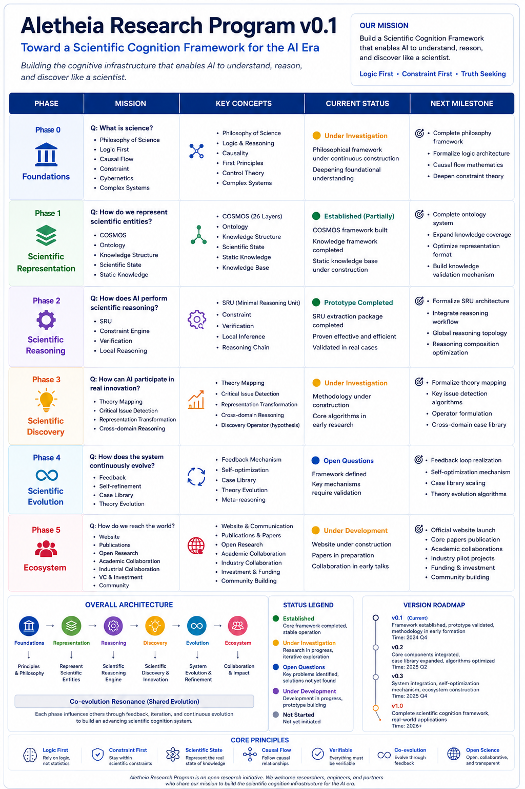
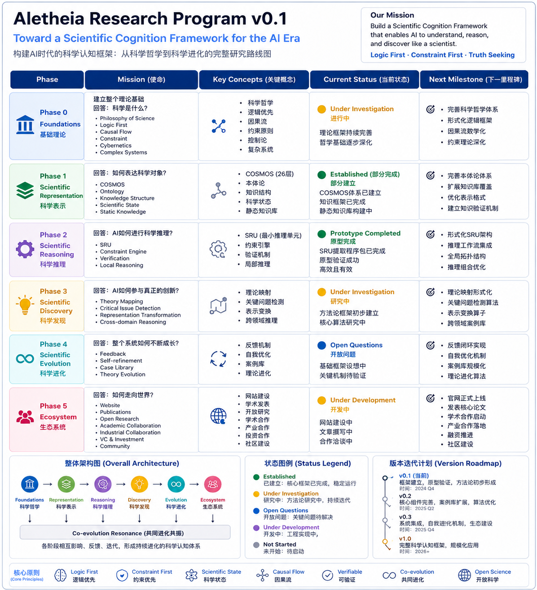

::: {.panel-tabset}
### English
## Aletheia Research Program v0.1

This roadmap outlines the journey toward a Scientific Cognition Framework. It is structured into six phases, evolving from fundamental logic to ecosystem impact.

::: {.callout-note appearance="minimal"}
{fig-align="center" width="100%"}
*(Fig: The Aletheia Research Program Roadmap v0.1)*
:::

### 中文
## Aletheia 研究计划 v0.1

本路线图旨在构建科学认知框架。通过从基础逻辑到生态影响的六个演进阶段，我们正逐步建立 AI 的认知基础设施。

::: {.callout-note appearance="minimal"}
{fig-align="center" width="100%"}
*(图：Aletheia 研究计划 v0.1 路线图)*
:::
::::